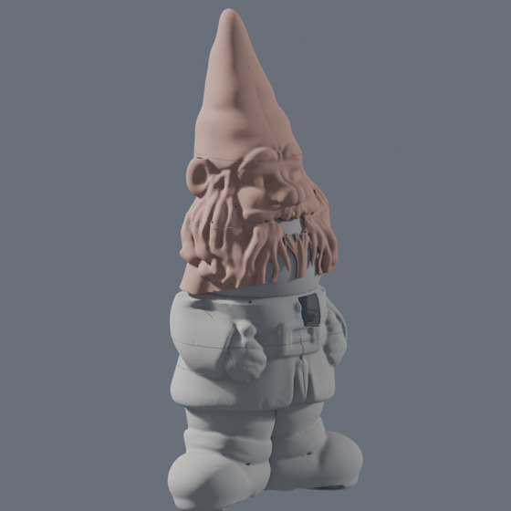
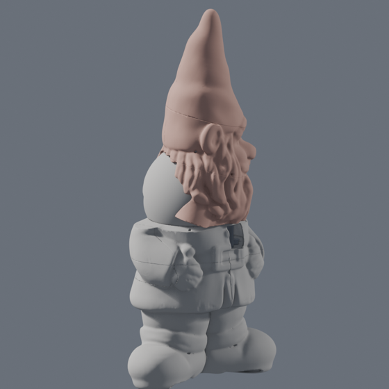
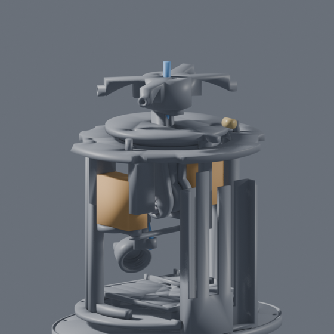
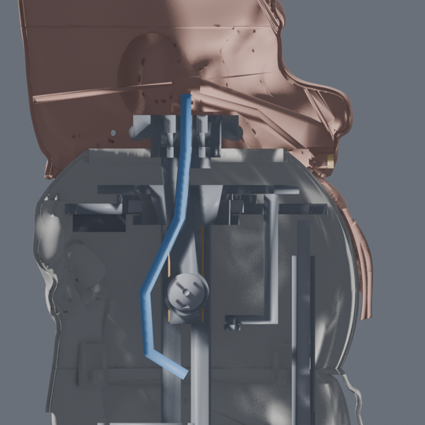
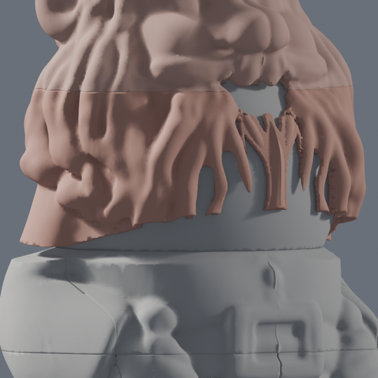
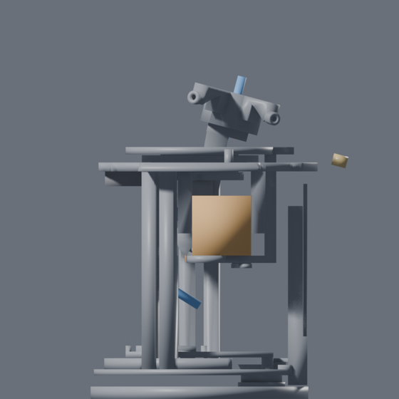
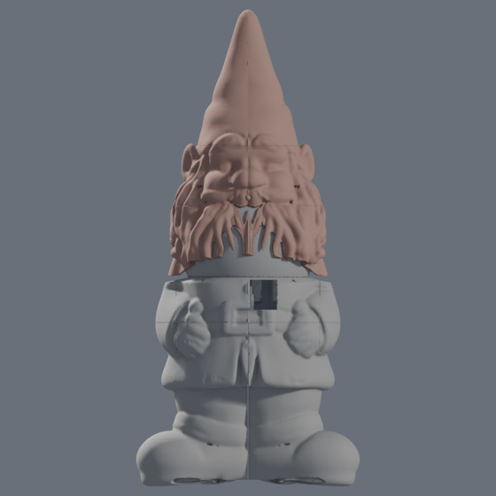
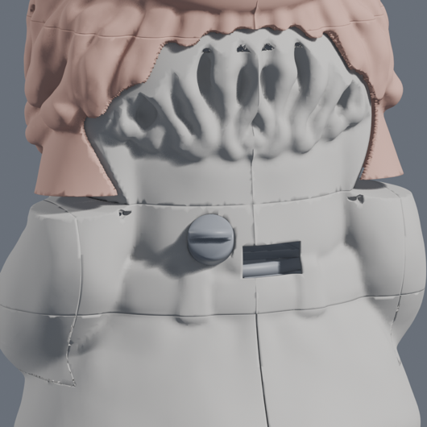

# The printed gnome

Every printed part of the deterrent, generated from one file of numbers. `params.py` is the only
place a dimension is written down; the mechanism is build123d, the shell is the reference
statue, and the two meet in `assemble.py`, where manifold booleans let the interface parts into
the shell and cut the openings out of it. Nothing generated is committed.

| | |
|---|---|
|  |  |
| At rest. Pink is what moves: beard, head and hat. | Turned +65°, nodded −15°: the collar's grey dome shows behind the beard. |
|  |  |
| The mechanism alone at rest: the cage, the deck with the pan servo (orange, left) and the nod servo (orange, right), the plate on its bearing, the stem and the spider, the tube in blue. | Cut at y = 0, at rest: the pin and the horn in the stem's hub at C, the stem up through the bearing, the deck and the plate to the spider, the tube in the stem, the brass nozzle in the mouth. |

*Renders from `build.py preview`, reduced. The full set - `pose_*` at rest, turned, nodded and
both, the mechanism from three sides, two cutaways and every section - is written to
`out/preview/`, and `out/statue/preview_*.png` and `out/preview/parting_*.png` show the statue and
its parting.*

The gnome stands **700 mm**. There are **twelve shell pieces** and **31 mechanism parts**, eight of
which are unioned into the shell rather than printed on their own, and the stop pin and the servo
shim print twice: **37 prints** in all, none wider than the 256 mm bed. About 1.9 kg of shell and 0.9 kg of
mechanism at 1.27 g/cm³.

The shell is an image-to-3D reconstruction of the user's own garden gnome, hollowed to a 2.4 mm
wall and parted on **one sphere**: the head pans ±65° and nods −15° (nose down) to +5° about a
single point C = (0, 0, 350) in the neck, and a rotation about a point keeps every sphere about it.
So the fixed coat is kept inside 98 mm of C and the turning unit - beard, head and hat - outside
100 mm, and no pan and no nod brings them together. The coat is the belt ring and, screwed onto
it, the **collar**: a socket closed over the top by a dome with a 55 mm bore, which the neck comes
up through. The nozzle is fixed in the mouth; the jet goes where the head looks.

**To look at the assembly in Blender:** `.venv-cad/bin/python cad/build.py scene` writes
`out/gnome.blend` with every section and part as its own object, in collections (Shell, with the
turning unit tinted apart; Mechanism split into fixed / pans with the plate / pans and nods /
pan linkage / interface; bought-part envelopes). `POSE=65,-15` before the command poses it.
`open -a Blender cad/out/gnome.blend`.

## Build

```bash
uv venv --python 3.11 .venv-cad
uv pip install --python .venv-cad/bin/python -r cad/requirements.txt

.venv-cad/bin/python cad/build.py              # every stage, about two minutes
.venv-cad/bin/pytest cad/tests -q              # 268 tests in eight files: the build's final check
.venv-cad/bin/pytest cad/tests -q -m "not slow"  # the quick suite, about 1 minute: leaves out test_wall and test_fit
```

Blender 5.2 is driven headless from `/Applications/Blender.app`; set `BLENDER` to point
somewhere else. It is the only thing not installed by pip, and it is used for nothing but
hollowing the statue and the previews.

| Stage | What it does | Time |
|---|---|---:|
| `statue` | the reconstruction into the project frame, hollowed in Blender, both voids cut back off the folds, measured, parted on the sphere, cut into the raw sections in `out/statue/raw/`, swept through pan and nod, and its own previews | 105 s |
| `mech` | build123d, after `statue`: every mechanism part to `out/step/` and `out/stl/`, in the frame it prints in; the placed `mechanism_assembly`; `out/placements.json` (where each part sits and how it moves) and the bought parts' envelopes to `out/stl/bought/` with `out/bought.json` | 8 s |
| `assemble` | trimesh + manifold3d: interface parts clipped into the cavity and unioned in, openings and screw holes cut, the beard split in two, twelve printable sections to `out/stl/`, and `out/stl/holes.json` - every radial hole's measured skin and insert floor | 6 s |
| `preview` | Blender: the posed renders and every section to `out/preview/` | 20 s |
| `scene` | Blender: `out/gnome.blend`, every section and part as its own object, posed | 3 s |

That is 2:07 measured for the whole build. The stages run in the order of the table, **`statue`
before `mech`**: the deck, the collar's tabs, the beard's tongues and the leg brackets are sized from
what the statue stage measures (`out/statue/features.json`), and there is no guess good enough to
build them from - a first build that guessed once printed collar tabs that missed the ring and beard
halves with no tongues. So `build.py mech` on a tree without the statue's outputs stops and says to
run `statue` first, and every builder that reads them raises rather than guessing. Stages can be run
on their own after that. The tests that need built files skip themselves when there are none. The `shell` stage is still in the list and does nothing.

A Blender script that raises still exits 0 - Blender prints the traceback and quits happily - so
the stages that drive it delete what each script owns before running it and check afterwards
that it came back, by name and by mtime.

## The statue

`cad/in/` holds the reference photographs of the statue - front, back, left, right, bottom and
three close-ups - `gnome_ai.glb`, the reconstruction made from them, and `fit_report.md`, the
measurement pass that turned it into the numbers in `params.py`.
**It is not committed** - it is 200 000 triangles of someone's garden ornament - so a fresh
clone builds the mechanism but stops at `statue` until the file is put back.

To make it again: clone `Tencent/Hunyuan3D-2`, install its `hy3dgen` package, and run the
multi-view pipeline `tencent/Hunyuan3D-2mv` on four photographs of the statue - front, back,
left, right, evenly lit, the whole figure in frame. On an M4 Pro it runs locally on MPS in fp16;
backgrounds come off with `rembg` first, the shape pipeline is given an octree resolution of 384
and 50 inference steps, and the result takes about twenty minutes. Export the mesh as GLB to
`cad/in/gnome_ai.glb`. Nothing else about the model matters to this build: the `statue` stage
scales whatever it is given to `Z_TOP` and puts it in the project frame itself.

What that stage does, in order:

1. **Frame.** X = z, Y = x, Z = y of the GLB; scaled so the height is exactly `Z_TOP`; the soles
   on z 0; the body axis on the Z axis.
2. **Straighten and mirror.** The reconstruction leans - its lower half is centred near y +4 and
   its head near y +16 - so each height is slid sideways onto the axis before the +y half is
   mirrored onto the −y one. The shear is in y alone, so every horizontal section keeps its own
   shape and nothing is made fatter. `out/statue/outer.stl` is the result.
3. **Hollow.** Blender's SOLIDIFY, inward, twice: `WALL` for the wall solid that `cavity.stl`,
   the plain void, is cut from, and 1.2 mm for the `cavity_grown.stl` the assembler clips
   interface parts to, so a boss ends inside the wall and fuses to it instead of hovering a
   clearance away.
   SOLIDIFY offsets a *surface*, not a solid, so wherever the skin has a ridge thinner than two
   walls - the fold of the skirt over the boots, the parting between two strands of the beard -
   the offset runs through itself and the void reaches into the ridge as a spike. The wall there
   measured nothing at all. So both voids are then cut back: the thin patches are found by
   measuring, and around each one the distance to the skin is sampled on a 0.7 mm lattice and
   its contour meshed and subtracted, which is the honest erosion of the solid and simply loses
   a ridge too thin to hold the offset. Each void is cut 0.2 mm under its own nominal - the
   cavity at `WALL − 0.2`, `cavity_grown` at `WALL − 1.2 − 0.2` - which is never deeper than
   that void already goes, so the grown cavity still contains the cavity and nothing the
   mechanism is fitted to moves. It is local: each void keeps its own surface everywhere it was
   already deep enough. `shell.stl` is taken from the cut-back cavity, so the two stay each
   other's complement in the skin. `test_wall.py` measures what comes out: `WALL_MIN` is the
   floor the wall may never go under, and `WALL_MIN − 1.2` the floor for the grown cavity - the
   skin a boss clipped to it must still have over it.
4. **Measure.** `out/statue/features.json` - the feature heights (measured on the mesh where it
   has a signature, from `STATUE_FEATURES` where it has not, and it says which is which), the
   cavity's reach from the pan axis every 5 mm in five directions, and the two trouser legs'
   centres and free radius at `Z_FLOOR − 50`. **Everything else reads that file rather than
   guessing at the skin**, including the layout tests and the pump and valve brackets.
5. **Cut.** The raw sections - two base halves, two mitten caps, the belt ring, the collar, two
   sleeve panels, beard, head, hat - and the turning unit is swept through pan ±65 by nod −15..+5
   against the fixed pieces to prove it touches none of them. Then `socket()` publishes the
   inside of the ring's top, the collar, the beard's top and the head's bottom into
   `features.json`, which the deck, the collar's tabs and the beard's tongues are sized from.

Every mesh it writes is read back from its own file and re-checked before the stage goes on: an
STL has no vertex identity, so a boolean that leaves two vertices in one place makes a solid
that is watertight in memory and not on disk.

## Before printing anything that touches a bought part

These numbers are listing-typical guesses. Measure the part in your hand, change `params.py`,
rebuild, and only then print anything that has to fit it.

| Parameter | Measure |
|---|---|
| `CAN_THREAD_PITCH`, `CAN_THREAD_LEN`, `CAN_NECK_ID` | **first, before anything else.** 3.0 mm, 12 mm and 30 mm are guesses, and the tank head's thread is cut to them. Measure the bottle's neck and **print `tank_head` first as the coupon** |
| `BOTTLE`, `BOTTLE_SHOULDER_H`, `BOTTLE_SHOULDER_IN`, `BOTTLE_THREAD_MAJOR` | the 1 L rectangular bottle lying on its wide face, **and the taper of its shoulder**: its shoulder corners pass the coat's wall with about 2.5 mm at both ends |
| `PUMP`, `PUMP_FEET` | the micro diaphragm pump's body and the pitch of its feet |
| `VALVE`, `VALVE_STRAP` | the solenoid's body, and how tall the strap has to arch over it |
| `DS3218` | the pan servo as delivered: body, tab span, tab thickness, tab height, shaft offset, hole pitch |
| `MG996R`, `SPLINE_BOSS` | **the nod servo**: its case 40.5 × 20 × 38 from the shaft face to the bottom, tab span 54, tab height 27 from the bottom, tab hole pitch 49.5 × 10, shaft 10 from the near end; and its top boss and spline as one cylinder, 12 across and 4.7 from the case to the round horn's far face. Its case face is 7 mm inside the cage's legs and the spline goes through a 14 mm hole in the +Y cheek |
| `HORN_D`, `HORN_T`, `HORN_SCREW_R` | the round horns in both servos' bags. The pan crank is pocketed for its horn from above; **the nod servo's round horn is let into the stem's hub** and screwed to it with four M2.5 self-tappers at r 7 |
| `BEARING_ID`, `BEARING_OD`, `BEARING_B`, `BEARING_IN_LAND_R`, `BEARING_OUT_LAND_R`, `BEARING_FIT` | **the 6810-2RS**, and **print its seats as a coupon first**: in the slicer, cut `deck.stl` to a Ø80 cylinder about the axis from z 394 to 402 and `plate.stl` to a Ø60 one from z 395 to 406 - two 10 mm rings, the outer ring's pocket and the inner ring's hub. The bearing should slide into both by hand; change `BEARING_FIT` (0.2) until it does. 50 × 65 × 7, and how far its inner ring's face runs out (53.5 across) and its outer ring's face runs in (61.5): the lips and the cap bear there and nowhere near the seals. Both printed seats are 0.15 over |
| `PIN_D`, `PIN_L`, `BUSH_OD`, `BUSH_L` | the Ø4 × 14 dowel and the 4 × 6 × 6 bronze bushing |
| `NOZZLE_D`, `NOZZLE_L` (`MOUTH_D` follows) | **the brass nozzle: Ø8 × 10 at most.** A 25 mm fountain nozzle does not fit - see the known limits. The holder's bore is 0.1 under `NOZZLE_D`, a press fit |
| `XL4015_HOLES`, `XL4015_HOLE_D`, `MOSFET_HOLES`, `ESP32` | the boards |
| `FAN`, `FAN_T`, `FAN_PITCH` | **a 30 mm fan** (3010), 24 mm screw pitch. It hangs under the deck's back and blows up through it |
| `LENS_CLIP_T`, `LENS_CLIP_W` | **the clip-on lens: at most 28 across and 12 proud of the back glass.** It goes in on the phone, and the sled's path past the ring's top has no more room than that |
| `GLAND_D` | the M12 cable glands' thread |
| `FLOAT_HOLE_D`, `DIP_TUBE_D`, `FILLER_D`, `TUBE_OD`, `TUBE_BEND_R` | the float switch, the dip tube, the filler, and the 6 mm PU tube |
| `FILLER_CAP_THREAD_MAJOR`, `FILLER_CAP_PITCH` | the filler cap is printed against its own neck; print the pair first as a coupon |
| `PHONE_L`, `PHONE_W`, `PHONE_T`, `PHONE_CAM_FROM_END`, `PHONE_CAM_FROM_SIDE` | the phone, with its case off |
| `HOSE_OD`, `HOSE_BARB_D`, `HOSE_BARB_L` | the filler hose |
| `INSERT_D`, `INSERT_DEPTH`, `INSERT_DEPTH_SHORT` | the heat-set inserts you actually bought |

## What prints, and how it lies on the bed

Material is **PETG** throughout; the turning unit is the part worth printing in ASA if you have an
enclosure. Four perimeters on anything the mechanism screws into; the divider at 100 % infill.

### Shell — twelve pieces

| File | What it is | mm | cm³ | g | On the bed |
|---|---|---|---:|---:|---|
| `base_left`, `base_right` | Boots, hem and skirt to the belt, split at y 0; drain arches, stake holes; the lower belt flange and the floor plate inside | 219 × 164 × 240 | 352, 353 | 447, 449 | Cut face down |
| `hand_left`, `hand_right` | The mitten caps, glued to the base halves | 127 × 31 × 44 | 14 | 18 | Cut face down |
| `torso` | The coat's belt ring, open on top: the camera window, the intake at the back (12 mm right of the meridian), the filler port, the upper belt flange inside, four countersunk holes for the collar | 188 × 210 × 67 | 180 | 228 | Belt down |
| `collar` | **The socket**: the coat from the ring's top up to the dome, closed over with a 55 mm bore, the bib the beard lies on, and four tabs under it that go 10 mm down into the ring | 184 × 196 × 134 | 200 | 253 | Tabs up, dome on the bed |
| `panel_left`, `panel_right` | The sleeves' sides, fixed, glued to the ring | 126 × 31 × 63 | 19 | 23 | Cut face down |
| `beard_left`, `beard_right` | **The beard in two halves**, split at y 0 and, in front of x 80, at y +2.5 round the middle web; each with two tongues up into the head | 180 × 115 × 113, 181 × 120 × 113 | 65, 66 | 82, 84 | Top edge down |
| `head` | Face, ears, the nozzle's holder printed in, the mouth, four countersunk M3 × 30 into the spider and four more for the beard's tongues; z 409 (the holder) to 503 (the scraps the hat's cut leaves) | 188 × 221 × 94 | 160 | 204 | Cut face down |
| `hat` | Brim and cone, glued to the head | 152 × 150 × 200 | 138 | 175 | Brim down |



*The parting at rest, from the statue stage: the beard lies 2 mm off the collar's bib, and the
coat's top edge slopes away under it rather than stepping.*

**Why the beard is two pieces.** Glued, the turning unit cannot go onto the collar at all. Its back
is the sphere wherever it faces the coat, and those faces look at C from directions that cover more
than a hemisphere - down to 22° under C at the back corners - so there is no straight path that
lifts it off: over 2 000 directions tried, the best still has some of the unit moving into the
collar (`test_the_glued_unit_has_no_way_on_and_its_pieces_have`). The head and hat alone lift
straight up; each half of the beard comes off sideways and up, 63° from vertical and 66° round from
the front to its own side. So the beard's halves go on first, each from its side, and then the head
and hat come down over them and are screwed to them.

### Mechanism — 31 parts

Eight never print on their own: they are blanks the assembler clips to the cavity and unions into a
shell section.

| File | What it is | mm | cm³ | g | On the bed |
|---|---|---|---:|---:|---|
| `belt_flange_lower`, `belt_flange_upper`, `floor_plate` | The belt joint's two rings and the wet zone's floor | — | — | — | — into the base halves and `torso` |
| `collar_spigot` | The collar's four tabs into the ring, with their inserts | — | 11 | — | — into `collar` |
| `nozzle_holder` | The O-ring socket on the axis for the tube's stab, the web forward, the nozzle's press bore | — | 25 | — | — into `head` |
| `beard_tongue` | The four tongues from the beard's halves up into the head | — | 5 | — | — into `beard_left`/`beard_right` |
| `divider` | The base's lid, sealed with a PU bead. **100 % infill, six perimeters** | 147 × 209 × 8 | 197 | 250 | Flat, with a brim |
| `sand_plug` | Closes the floor plate's pour hole | 38 × 38 × 6 | 4 | 5 | Disc down |
| `chassis` | The dry zone's floor, **71.5 × 77 now** so it goes in through the ring's top; three screws at the back, at 185/200/215°, and cut back to r 61 under the filler port | 134 × 154 × 12 | 65 | 83 | Flat |
| `filler_port` | The filler through the ring's back: a cup round the cap's pocket, a channel in and down, a barb pointing down with a drip lip | — | 11 | — | — into `torso` |
| `filler_neck` | The M22 neck in the pocket; unioned unclipped, after the pocket is cut | — | 2 | — | — into `torso` |
| `filler_cap` | The M22 cap with its O-ring groove and a 26 × 5 × 6 grip bar | 28 × 28 × 20 | 6 | 7 | Open end down |
| `phone_sled`, `electronics_deck`, `tank_cradle`, `tank_head`, `pump_bracket`, `valve_bracket`, `valve_strap` | as before | | | | as before |
| `deck_ring` | The cage: four legs from the chassis to the deck, tied at their feet | 87 × 131 × 134 | 65 | 83 | Foot ring down, no support |
| `deck` | Carries the bearing's outer ring on a lip, the pan servo hanging beneath, the 30 mm fan, the pan stops. Its outline is the collar's narrowest opening under it less 1.5, and the socket's sphere less 1.5 | 148 × 163 × 48 | 93 | 118 | Top face down, hangers up |
| `bearing_cap` | Clamps the bearing's outer ring down; three countersunk M3 × 8 | 79 × 80 × 5 | 8 | 11 | Top face down |
| `plate` | Rides the inner ring: disc, hub, the −Y cheek with the bushing and the stop slot, the thin +Y cheek, the nod servo's posts, the column down to the pan linkage — one print | 114 × 100 × 79 | 82 | 104 | Disc down |
| `hub_ring` | Clamps the inner ring up against the plate's shoulder; two radial countersunk M3 × 10 | 60 × 60 × 7 | 5 | 6 | Flat |
| `stop_pin` | **Glued** into the deck; the plate's tab runs into it at ±65°. **Print two** | 6 × 6 × 15 | 0.4 | 1 | On end |
| `stem` | The blade the head stands on: its hub on the pin at C with the collar and the horn's drive slots on its +Y face, its neck through the bearing, its head under the spider; the tube runs inside it | 28 × 19 × 95 | 18 | 23 | **On its side**, −Y face down |
| `servo_shim` | Between one of the nod servo's tabs and its post, 2 mm. **Print two** | 15 × 2 × 6 | 0.1 | 0 | Flat |
| `tube_clip` | Holds the tube vertical under the yoke; screws to a lug on the −Y cheek | 14 × 21 × 33 | 2 | 3 | On its plate |
| `spider` | On the stem's head; four radial inserts at z 440, faces at r 57, for the head's four screws | 65 × 103 × 24 | 41 | 52 | Top face down |
| `servo_crank`, `pan_link` | The pan parallelogram, as before but with a 26 mm crank, 3 mm lower | | 3, 1 | 3, 2 | Flat |

**Measured, not assumed** - the down-facing area within 45° of horizontal with nothing within a
millimetre under it: `plate` disc down **637 mm²** (8 005 the other way up: the cheeks and posts
hang), `stem` on its side **710 mm²** (the tube's channel and the horn's pocket bridging), `spider`
top down **344 mm²** (1 933 hub down), `bearing_cap` top down **12 mm²**, `hub_ring` **20 mm²**,
`deck` hangers up **408 mm²** (its rim is bevelled to the socket's sphere now; 13 034 the other
way), `deck_ring` foot ring down **50 mm²**.

## The nod drive



*Nodded −15°, from the side: the stem, the spider and the nozzle (brass, right) have turned about
the pin; the plate, the servos and the deck have not.*

- **The pan bearing** is a 6810-2RS, 50 × 65 × 7. Its outer ring drops into a pocket in the deck
  onto a 1 mm lip and is clamped from above by the printed cap; its inner ring is on the plate's
  hub under a shoulder, clamped from below by the hub ring. Both seats are 0.2 mm over. A single
  row carries it: 7.4 N of weight and about 35 N on the loaded side from 1 N·m of wind, against a
  static rating of kilonewtons. What it cannot do is resist tilt with a second row, so its radial
  clearance shows as a few arc-minutes of rock - 0.5 to 1 mm at the hat's tip.
- **The plate and its yoke** pan. The hub goes down through the bearing to z 388 and the cheeks
  hang from it to C. Everything below the hub is inside r 23.3, so the plate drops through the
  bearing's bore. The neck of the stem swings in a slot through the plate and the hub.
- **The pin** is a Ø4 × 14 dowel along Y through C, pressed into the stem's hub and held by an M2
  set screw from behind, turning in a 4 × 6 × 6 bushing in the −Y cheek. It is loaded to 0.5 MPa.
- **The stem** is a 12 mm blade, 15 wide at the neck, leaning back 5° so that over −15..+5 it swings
  −10..+10 from vertical. The hole it needs through the bearing is **33.0, 35.0 and 37.0 mm** across
  at z 394, 400 and 406, measured by slicing it at every degree of the nod; the bearing's bore is
  50. Its neck bends to 1.3 MPa in a 20 m/s wind.
- **Two bearings carry the stem; the servo only turns it.** On −Y the pin runs 6 mm in the bushing.
  On +Y a collar on the hub's face - a cup r 11–13 the servo's round horn sits in - runs 6.6 mm in a
  bore in the +Y cheek, 0.25 radial clearance. They are 19.1 apart: a side wind on the unit (0.03 m²,
  Cd 1.2, 112 mm above C) puts 12, 26 and 52 N on them at 10, 15 and 20 m/s - 0.3 MPa on the collar
  and 2.3 MPa on the bushing at 20 m/s - where before it was the MG996R's output shaft that took it.
  The unit rolls 0.75° on their clearances, 4 mm at the hat's tip.
- **The nod servo**, an MG996R, hangs on the +Y side, shaft on the Y axis at C, case face at y 13.5
  and out to y 51.5, 3.7 mm from the cage's legs at the nearest pose. Its tabs lie on two printed
  shims (`servo_shim`, 2 mm, print two) on two posts on the plate: the posts stop short so the plate
  and yoke still drop through the bearing's 50 mm bore. The horn drives the stem through two pins -
  M2.5 × 8 screws through two of its holes, standing 3 mm out - in two radial slots in the hub's
  face: torque passes, a millimetre of misalignment between the shaft and the collar's bore does not.
  **Not the arrangement first asked for** (a horn clamped on the pin outside a cheek): there is not
  the room between the hub's face and the cage's legs for a cheek, a coupler and a horn.
- **Hard stops** at **−18° and +8°**, three degrees outside the range, because a degree is 0.15 mm of
  lug travel and a print is not that true. A sleeve on an M3 screw in the hub's −Y face runs in an
  arc slot in the −Y cheek, 0.3 each side, whose ends meet it exactly there
  (`test_the_nod_stops_meet_the_lug_exactly`). The head can reach the stops, so everything is
  checked there: the parting's nod trim and sweep cover −18..+8 (17.3 cm³ off the beard's bottom
  rim), and so does the pose sweep.
- **Fits** a printer can hold: the pan column 0.7 in the deck's arc slot, the blade 0.5 each side
  between the cheeks with its first 0.6 mm on the bed stepped in 0.6 against the elephant's foot,
  the bearing's seats 0.2 (print them as a coupon first: "Before printing", above), the stem's collar 0.25.
- **Loads.** Gravity puts 0.05 N·m on the servo at rest and 0.10 nose down 15°. Wind on the head:
  0.24, 0.55 and 0.97 N·m at 10, 15 and 20 m/s; the last is the servo's stall, and past about 15 m/s
  a gust back-drives the head onto its stops, which is what they are for.
- **The spider** is bolted to the stem's head by two M3 × 12 from above and carries the turning unit
  on the four radial inserts the old shroud had. Outside r 28 its undersides are the sphere 100.5
  from C, so it keeps off the dome at every pose (2.44 mm at the nearest, nose down).
- **The nozzle** is fixed in the mouth, pressed into a holder printed with the head, its axis along
  +X at z 424, its tip 1.1 mm proud of the skin. The water joint is made by putting the head on: the
  tube runs inside the stem, stands 12 mm out of the spider's top on the axis as a stab, and the
  holder's socket, with a 5 × 1.5 O-ring, slides down over it. The spider's clamp screw stops the
  water pushing the tube down, 20 N at 7 bar.
- **The tube** runs from the stab down the stem's channel, its corners filleted, out of the neck's
  back at z 362 close to C, then in a free loop to a printed `tube_clip` screwed to the −Y cheek,
  which holds it vertical at (−21, 0, 305–313). The loop is one length, 58 mm: nearly taut nose-down
  at −18, bowed 8 mm more nose-up at +8, and nowhere on the tube is a bend tighter than 23 mm
  (`TUBE_BEND_R` is 15) - modelled as a Bezier fitted at each nod, tested at the stops and between.
  Below the clip the tube is **not held**: it runs free down the board deck's back edge to the valve's
  gland and takes the pan's twist over that length, so leave it slack there.

## Fasteners

M3 heat-set inserts everywhere a printed part is screwed into, M3 machine screws through. Depths
are what the geometry gives; the radial screws' lengths come from the holes the assembler drilled,
measured skin to insert floor (`out/stl/holes.json`, `test_the_radial_screws_are_the_right_length`).

| Part | Feature | Count | Type |
|---|---|---|---|
| `belt_flange_lower` | the belt ring's four, down from `Z_BELT` | 4 | M3 insert, **9 mm** |
| `belt_flange_upper`, `divider` | the same four, through | 4 | **M3 × 20** — the belt |
| `belt_flange_upper` | three at the back, at 185/200/215°, up | 3 | M3 insert, 6 mm — the chassis |
| `chassis` | the same three, through | 3 | M3 × 10 |
| `floor_plate` | the cradle's four and the two brackets' eight | 12 | M3 insert, 6 mm |
| `tank_cradle`, `pump_bracket`, `valve_bracket` | through into those | 12 | M3 |
| `valve_bracket` / `valve_strap` | the strap | 2 | M3 insert, 6 mm / M3 |
| `chassis` | two sled locks, three e-deck standoffs | 5 | M3 insert, 6 mm |
| `phone_sled`, `electronics_deck` | into those | 5 | M3 |
| `deck_ring` | four feet, up | 4 | M3 insert, 6 mm — up through the chassis |
| `deck_ring` | four leg tops | 4 | M3 insert, **7 mm** — the deck's four |
| `deck` | four hangers, up | 4 | M3 insert, 6 mm — the pan servo's tabs |
| `deck` | four round the fan's hole, up | 4 | M3 insert, **4 mm** — the fan |
| `deck` | three under the cap, down | 3 | M3 insert, **4 mm** |
| `bearing_cap` | the same three, countersunk | 3 | **M3 × 8 countersunk**, driven through the plate's three holes at pan 0 |
| `plate` | two radial in the hub, at 90/270° | 2 | M3 insert, 6 mm |
| `hub_ring` | the same two, countersunk | 2 | **M3 × 10 countersunk**, on the bench |
| `plate` | four on the nod servo's posts | 4 | M3 insert, 6 mm — the MG996R's tabs, **M3 × 14** through the tab and a 2 mm shim |
| `plate` | the tube clip's, in a lug on the −Y cheek | 1 | M3 insert, 6 mm — M3 × 10, along +Y on the bench |
| `plate`, `servo_crank` | the link's two pivots | 2 | M3 insert, 4.5 mm |
| `stem` | the stop lug's, in the hub's −Y face | 1 | M3 insert, 6 mm — an M3 × 10 through a Ø6 sleeve |
| `stem` | two in its head, down | 2 | M3 insert, 6 mm — **M3 × 12** down through the spider |
| `stem` | the pin's set screw | 1 | M2 × 4 grub, self-tapped |
| nod horn | two of its holes | 2 | **M2.5 × 8** through the horn into its own holes, 3 mm standing out as drive pins |
| `spider` | four radial at z 440 | 4 | M3 insert, 6 mm — the head's **M3 × 30 countersunk** |
| `spider` | the tube's clamp | 1 | M3 insert, 6 mm — M3 × 8 |
| `collar_spigot` | four radial in the tabs | 4 | M3 insert, 6 mm — **M3 × 16** at 45/315°, **M3 × 20** at 125/235°, countersunk, through the ring |
| `beard_tongue` | four radial | 4 | M3 insert, 6 mm — **M3 × 8** at 45/315°, **M3 × 14** at 90/270°, countersunk, through the head |
| `servo_crank` | the pan horn's four | 4 | M2.5 self-tapping |
| `electronics_deck` | the modules' own feet | 20 | their own screws |

**Totals.** **70 M3 inserts** - 4 at 9 mm, 4 at 7 mm, 2 at 4.5 mm, 7 at 4 mm and **53 at 6 mm** - and
70 M3 screws to fill them: 4 × M3 × 20 (belt), 4 × M3 × 30 countersunk (head onto the spider),
2 × M3 × 16 and 2 × M3 × 20 countersunk (the collar), 2 × M3 × 8 and 2 × M3 × 14 countersunk (the
beard's tongues), 3 × M3 × 8 countersunk (bearing cap), 2 × M3 × 10 countersunk (hub ring),
4 × M3 × 14 (the nod servo's tabs), 2 × M3 × 12 (spider), 1 × M3 × 10 (tube clip), and the rest
socket heads between 8 and 14 mm. Plus 4 M2.5 self-tappers for the pan horn and 2 M2.5 × 8 as the
nod horn's drive pins, one M2 grub for the pin, the modules' own screws, a Ø4 × 14 dowel, a
4 × 6 × 6 bushing and a 5 × 1.5 O-ring.

Where the M3 × 30 comes from: the head's skin at z 440 is r 84.33 at 60 and 300° and r 84.09 at
120 and 240°; the spider's boss faces are at r 57 and its inserts' floors at 51. So the hole is 27.1
to 27.3 mm deep to the boss's face and an M3 × 30 takes 2.7 to 2.9 mm of its insert.

## Assembly

Heat every insert first. The order below is **swept** by `test_assembly.py`: each step's parts are
moved along their path 2 mm at a time against everything already in, and touch nothing.

**The legs and the base**, as before: the pump's and the valve's brackets up into the floor plate
while each half is open, then the halves glued, the mitten caps, the sand and its plug, the bottle
in its cradle, the tank head, the filler hose on the tank head's barb and threaded up through the
divider's hole at the back (147°, r 71), the divider with its bead and glands, the belt ring with
its sleeves - the hose through its flange's bore on the way - and the four M3 × 20 belt screws.
Push the hose up onto the filler port's barb, inside the ring's back, before the chassis goes in.

**On the bench: the cage onto the chassis** (four M3 × 10 up into its feet), then the pair **down
through the ring's top** onto the flange, three screws at the back. The chassis is 71.5 × 77 so that
it passes: the ring's top, chamfered by the parting, is 79.9 out at the sides and 73.3 at the back.

**The boards**, down onto their standoffs, and **the phone** in its sled **with the lens clipped on**,
down through the chassis's pocket; two lock screws. The clip - a 28 mm barrel 12 proud of the back
glass and a clamp round the phone's edge - reaches 89.8 mm out, and the ring's top edge is 84-87
there, so the sled does not come straight down: it comes down **6 mm behind its place**, and for the
last 20 mm is pushed forward and let down onto its lugs. 6 is all the room there is: the sled's
lugs pass the boards' front edge on the way, and they were shortened by 2.3 mm (to cover the lock
screw's head and a millimetre, not the whole boss) to make it. The upper belt flange is notched for
the clip's barrel, which hangs down past the ring's top. Service lifts it out the same way.



**On the bench: the deck sub-assembly**, in this order - every screw's driver path is checked
against what is on the bench at that moment (`bench_screws()` in `test_mech.py`):
1. the bearing cap loose over the plate's hub, then the 6810 up over the yoke onto the hub, then the
   hub ring up over the yoke and its two radial countersunk screws;
2. the plate and bearing down into the deck (the column through its arc slot), and the cap's three
   screws through the plate's three holes;
3. the stem down through the plate's slot; the pin through the bushing into the hub and its set
   screw from behind; the stop lug's screw and sleeve; the tube clip onto its lug, one screw along +Y;
4. the round horn on the nod servo's spline, its two drive pins in; the servo in from +Y, the pins
   into the hub's slots, the collar into the cheek's bore; two shims and four screws into its posts;
5. the fan, the pan servo into its hangers, the stop pins glued.

**The deck sub-assembly** goes down onto the cage's four legs and four screws; then **the crank and
the link** from below, between the legs, as before.

**The collar**, down over all of it - its opening is what the deck's outline was trimmed to - onto
the ring, its tabs 10 mm into the ring's top; four countersunk screws through the ring into them.

**The spider** onto the stem's head, two M3 × 12 from above; the tube's clamp screw.

**The beard's two halves**, each on from its own side, up and in, and then **the head with the hat
glued to it** straight down over the spider - its socket slides onto the tube's stab - and eight
countersunk screws from outside: four into the spider, four into the beard's tongues.

## Service

- **The phone** comes out after the head, the beard's halves, the spider, the collar and the deck
  sub-assembly: 8 + 4 + 2 + 4 + 4 screws (the crank and the link come out with the deck, they hang
  under it), and the tube's stab pulls out of the head's socket as the head lifts. Then the sled's two screws and it lifts straight up.
  This is more than it was, and it is honest: the phone is under everything that turns.
- **The head** alone comes off on its eight screws; with it off the spider, the stem's head and the
  dome's bore are in view, and nothing below the dome is reachable.
- **Refilling needs nothing taken off: unscrew the cap on the coat's back, pour.** The port is on
  the belt ring at 160°, beside the air intake, its axis 30° up and out at z 286, so it takes a
  funnel or a bottle's spout; fill with the head parked (the firmware parks it at 0 when disarmed) -
  a Ø25 spout 80 long is clear of everything from the −65 stop to +35, past that the beard's flank
  comes round over it. The cap sits sunk in the port's pocket, its body 8.5 mm out of the skin and
  its grip bar 14.5, 26 long, for a gloved hand. What spills outside runs down the coat's back; what
  stands in the pocket runs in, or out through the weep at its lowest point; a leak at the one
  joint inside, the port's barb, meets a drip lip that leads it onto the hose, and the hose's bores
  through the chassis, the flanges and the divider are 1.5 mm round it, so it runs down into the wet
  side at the back - 120 mm from the phone, 16 mm outside the boards. Filling runs at about 1.1
  L/min falling to 0.75 as the bottle fills: a minute for a litre.

  
- **The bottle** comes out only by opening the belt.

## What the tests check

`test_params.py` (20) is arithmetic on `params.py`: the stack, the phone under the deck, the
linkage clear of the pan axis, the nod stops three degrees outside the owner's range, and - a strict
xfail - the firmware's tilt limits, which are still −30/+40 until the follow-up on the firmware
branch.

`test_mech.py` (46) builds every build123d part: valid, one solid, in the bed; each part sized
from the statue's measurements refusing to build without them; the cage inside the
turning bore; the bearing seated and held both ways, each clamp on its own ring and off the seals;
the yoke through the bearing's bore; the stem's channel; the clear hole; the stem clear of the yoke
at every degree; the nod stops meeting the lug exactly; the stem carried by two bearings with the
servo taken away; the tube's loop one length with no bend under 23 mm at any nod; the nod servo
seated on its shims and 3 mm or more inside the cage's legs; the pin and the bushing; the spider's inserts and its keeping off the dome;
the deck inside the socket and the collar's shadow; the linkage through the whole pan, and 2 mm under
the yoke; every group of parts, bought ones included, overlapping nothing but its designed contacts;
and every bench screw's driver path.

`test_wet_and_head.py` (17) is the wet zone: the cap on the port's neck; the port 43 mm over the
bottle's top with the hose falling all the way; the hose from the port's barb to the tank head's,
touching nothing else and nothing with 3 mm more round it; both barbs; a drip down the hose going
through to the wet side; the divider closing to 0.5 round it, with its funnel and skirt.

`test_fit.py` (4): every placed part inside `cavity.stl`, and everything fixed or panning over the
ring's top inside the socket's sphere, bought parts included.

`test_wall.py` (17) measures the shell's wall, and casts rays for holes a thickness sample cannot
see.

`test_shell.py` (106): every section watertight, one body, in the bed; no two share a millimetre;
every interface part welded into its section, and at least 90 % of each blank welded at all (the
assembler refuses less); every radial screw with its receiving part's boss and insert bore behind
its hole, measured by rays on the assembled STLs; the window, the intake, the mouth and the dome's bore
open, and the seam air all round; the head's four screws on their inserts; the unit turned over the
fixed mechanism - the xfail on the deck is gone, the deck is 5.9 mm from the unit at the nearest -
and to its stops against the fixed shell; the jet's 3° cone clear of the beard and moustache.

`test_pose.py` (34 - every pose moves Manifolds united once at rest, and the gaps are manifold3d's
`min_gap`): **the whole machine posed**, pan −65, −30, 0, 30, 65 by nod −18, −15, −8, 0, +5, +8 -
what nods, what pans, the linkage and the tube against what is fixed and against each other; the
least gap to each neighbour, the shell's pieces included, at the worst pose; no fin on the beard's
cut; the parts in the turning shell placed as turning; and the 2 mm seam, proved by distance from C
over 20 000 surface points a piece.

`test_assembly.py` (24): the order above, swept step by step, with only the declared pairs (the
collar on the ring, the head on the beard's halves) allowed to touch at home; the filler port open, its cap on it and
14.5 mm out of the skin, its weep draining, a funnel and a hand reaching it with the head parked and
how far the head may turn with a funnel in it; why the beard is in halves; the
chassis through the ring's top; the collar joint's screws under the unit at rest and reachable with
a driver's handle behind the shank; the
radial screws' lengths; and the phone going in with its lens clipped on, along its dog-leg, which
straight down it could not.

## Known limits

- **Do not power the nod servo with today's firmware.** It still drives the tilt channel over
  −30..+40, and the printed stops are at −18 and +8: powered, the MG996R stalls against a stop and
  cooks. The firmware branch has to set `tiltMin`/`tiltMax` in `firmware/lib/dwarf/types.h` to
  −15/+5 (and its calibration to an MG996R's) first; `test_the_firmware_tilt_limits_sit_inside_the_nod_stops`
  is a strict xfail until it does.

- **The dome shows when the head turns.** The collar's grey sphere is what the beard lies on, and
  at 65° it is bare behind the beard. That is inherent to parting on a sphere.
- **Gusts over about 15 m/s back-drive the nod** onto its stops. The MG996R stalls at about
  1 N·m and 20 m/s puts 0.97 on it. The stops are printed and take it.
- **The nozzle is 10 mm long, not 25.** The unit keeps 100 mm from C where it faces the coat, and
  at the mouth that sphere is at x 67; with the nozzle's radius and the holder's wall, its back can
  be no nearer the axis than x 73.5, and its tip is at the skin. Buy a short one.
- **The horn drives the stem through two pins, not a clamp on the pin**; the stem runs in its own
  two bearings. See the nod drive above for the numbers.
- **The beard is two prints**, for the reason above, and there are 8 screws in the head where
  there were 4.
- **The phone goes in on a dog-leg** with its lens clipped on (above). A clip wider than 28 mm or
  standing out more than 12 does not go in at all: measure it (`LENS_CLIP_W`, `LENS_CLIP_T`).
- **Rim beading and the beard's centre lock.** The unit's rim is a smoothed curve on the sphere with
  a turned-in flange; where the skin was thinner than the wall it was lifted, and in print the edge
  will bead. The beard's centre lock hangs from the moustache by skin just under the wall and is
  slightly frayed.
- **Fill with the head parked.** No port anywhere on the coat is clear of the turning unit at both
  pan stops - its beard flanks and its low back corners, swept through ±65°, cover every azimuth -
  so a funnel in the port at 160° is clear from −65° to +35° and not past that.
- **The phone is under everything.** Servicing it takes the unit, the spider, the collar and the
  deck off.
- **The exhaust is the dome's bore and the 2 mm seam**, and nothing is filtered or sealed: rain on
  the seam runs down the collar's outside, but rain that reaches the bore goes onto the plate.
- **The tightest bought part is still the bottle** (2.5 mm at its shoulder corners), and the
  tightest fits in the neck are the stem's collar in its bore (0.25), the stop lug in its slot (0.3
  each side) and the blade between the cheeks (0.5).
- **The divider has a 0.5 mm gap round the filler's hose**, 13 mm², between the water's side and the
  electronics' - small, but not a seal. Run a bead of the divider's PU round the hose to close it.
