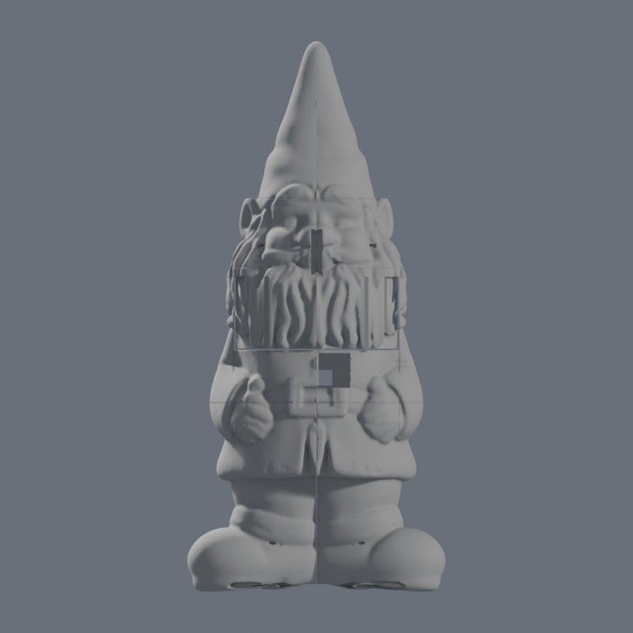
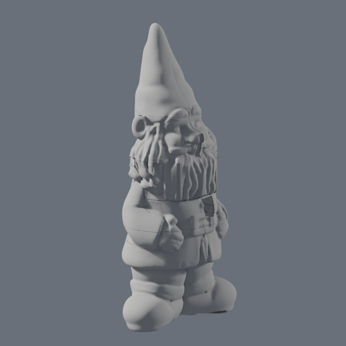
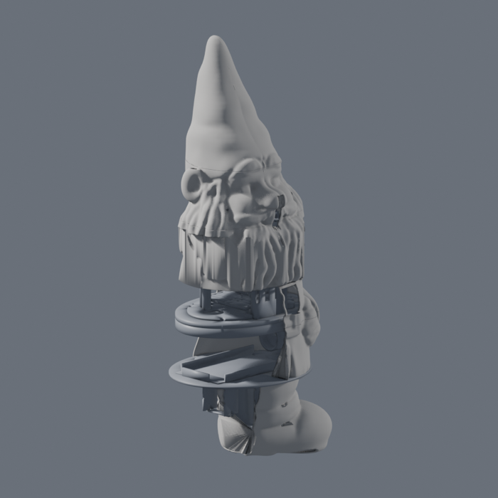
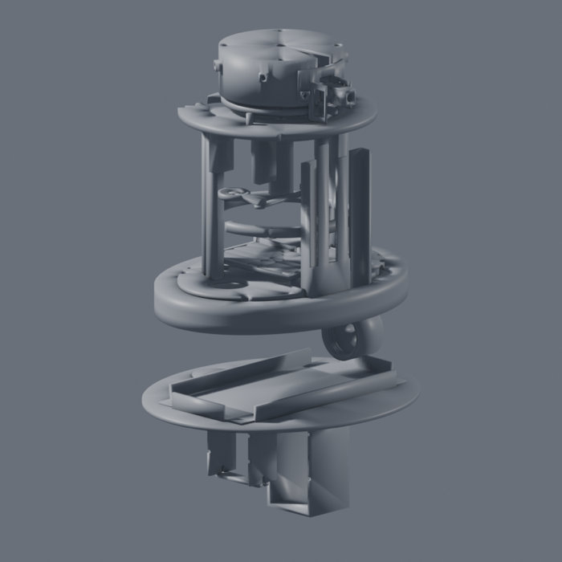

# The printed gnome

Every printed part of the deterrent, generated from one file of numbers. `params.py` is the only
place a dimension is written down; the mechanism is build123d, the shell is the reference
statue, and the two meet in `assemble.py`, where manifold booleans let the interface parts into
the shell and cut the openings out of it. Nothing generated is committed.

The gnome stands **700 mm**. There are **ten shell sections** and **25 mechanism parts**, three
of which are unioned into the shell rather than printed on their own, and the stop pin prints
twice: **33 prints** in all, none wider than the 256 mm bed. About 1.8 kg of shell and 1.1 kg of
mechanism at 1.27 g/cm³.

The shell is no longer sculpted. It is an image-to-3D reconstruction of the user's own garden
gnome, hollowed to a 2.4 mm wall and cut into pieces around what has to turn: the coat's belt
ring and the two sleeve panels stay still, and everything above the beard's bottom edge - beard,
face, ears, hat - is one **bell** that turns on the neck shroud through ±65°. The head does not
nod; only the nozzle tilts, on a micro servo inside the beard, and its jet leaves through the
beard's parting under the mouth. There is no belly hatch: with the bell lifted off, the whole
inside is open from the top.

 

 

*Renders from `build.py preview`, reduced. The full set is written to `out/preview/`, and
`out/statue/preview_*.png` shows the statue, its sections and the bell on its own.*

**To look at the assembly in Blender:** `.venv-cad/bin/python cad/build.py scene` writes
`out/gnome.blend` with every section and part as its own object, in collections (Shell, with the
bell tinted apart from the fixed pieces; Mechanism split into fixed / turns with the head /
interface; bought-part envelopes as wireframes). `open -a Blender cad/out/gnome.blend`.

## Build

```bash
uv venv --python 3.11 .venv-cad
uv pip install --python .venv-cad/bin/python -r cad/requirements.txt

.venv-cad/bin/python cad/build.py              # every stage, about a minute
.venv-cad/bin/pytest cad/tests -q              # 163 tests, about a minute
```

Blender 5.2 is driven headless from `/Applications/Blender.app`; set `BLENDER` to point
somewhere else. It is the only thing not installed by pip, and it is used for nothing but
hollowing the statue and the previews.

| Stage | What it does | Time |
|---|---|---:|
| `mech` | build123d: every mechanism part to `out/step/` and `out/stl/`, in the frame it prints in, plus the placed `mechanism_assembly` in both formats | 8 s |
| `statue` | the reconstruction into the project frame, hollowed in Blender, measured, and cut into the ten raw sections in `out/statue/raw/` | 30 s |
| `assemble` | trimesh + manifold3d: interface parts clipped into the cavity and unioned in, openings cut, ten printable sections to `out/stl/` | 6 s |
| `preview` | Blender: 38 renders to `out/preview/` — the gnome, each section, the mechanism, and a cutaway | 16 s |
| `scene` | Blender: `out/gnome.blend`, every section and part as its own object in assembled position | 3 s |

That is about a minute on an idle machine; with other work running it has been measured at 1:48.
Stages can be named individually and run in any order, as long as `mech` and `statue` have run
before `assemble`. The tests that need built files skip themselves when there are none. The
`shell` stage is still in the list and does nothing: it says so and points here.

A Blender script that raises still exits 0 - Blender prints the traceback and quits happily - so
the stages that drive it delete what each script owns before running it and check afterwards
that it came back, by name and by mtime. A broken run fails the build instead of quietly leaving
yesterday's mesh for everything downstream to validate.

## The statue

`cad/in/` holds the reference photographs of the statue - front, back, left, right, bottom and
three close-ups - `gnome_ai.glb`, the reconstruction made from them, and `fit_report.md`, the
measurement pass that turned it into the numbers in `params.py`.
**It is not committed** - it is 200 000 triangles of someone's garden ornament - so a fresh
clone builds the mechanism but stops at `statue` until the file is put back.

To make it again: clone `Tencent/Hunyuan3D-2`, install its `hy3dgen` package, and run the
multi-view pipeline `tencent/Hunyuan3D-2mv` on four photographs of the statue - front, back,
left, right, evenly lit, the whole figure in frame. On an M4 Pro it runs locally on MPS in fp16;
backgrounds come off with `rembg` first, the shape pipeline is given an octree resolution of 384
and 50 inference steps, and the result takes about twenty minutes. Export the mesh as GLB to
`cad/in/gnome_ai.glb`. Nothing else about the model matters to this build: the `statue` stage
scales whatever it is given to `Z_TOP` and puts it in the project frame itself.

What that stage does, in order:

1. **Frame.** X = z, Y = x, Z = y of the GLB; scaled so the height is exactly `Z_TOP`; the soles
   on z 0; the body axis on the Z axis.
2. **Straighten and mirror.** The reconstruction leans - its lower half is centred near y +4 and
   its head near y +16 - so each height is slid sideways onto the axis before the +y half is
   mirrored onto the −y one. The shear is in y alone, so every horizontal section keeps its own
   shape and nothing is made fatter. `out/statue/outer.stl` is the result.
3. **Hollow.** Blender's SOLIDIFY, inward, twice: `WALL` for `shell.stl`, and 1.2 mm for the
   `cavity_grown.stl` the assembler clips interface parts to, so a boss ends inside the wall and
   fuses to it instead of hovering a clearance away. `cavity.stl` is the plain void.
4. **Measure.** `out/statue/features.json` - the feature heights (measured on the mesh where it
   has a signature, from `STATUE_FEATURES` where it has not, and it says which is which), the
   cavity's reach from the pan axis every 5 mm in five directions, and the two trouser legs'
   centres and free radius at `Z_FLOOR − 50`. **Everything else reads that file rather than
   guessing at the skin**, including the layout tests and the pump and valve brackets.
5. **Cut.** The ten raw sections, and the bell is turned through its stops against the fixed
   pieces every 5° to prove it does not touch them.

Every mesh it writes is read back from its own file and re-checked before the stage goes on: an
STL has no vertex identity, so a boolean that leaves two vertices in one place makes a solid
that is watertight in memory and not on disk.

## Before printing anything that touches a bought part

These numbers are listing-typical guesses. Measure the part in your hand, change `params.py`,
rebuild, and only then print anything that has to fit it.

| Parameter | Measure |
|---|---|
| `BOTTLE`, `BOTTLE_SHOULDER_H`, `BOTTLE_SHOULDER_IN`, `BOTTLE_THREAD_MAJOR` | the 1 L rectangular bottle lying on its wide face, **and the taper of its shoulder**: its shoulder corners pass the coat's wall with about 2.5 mm at both ends. A squarer bottle does not go in |
| `PUMP`, `PUMP_FEET` | the micro diaphragm pump's body and the pitch of its feet — it stands in the left trouser leg, hanging under the floor plate |
| `VALVE`, `VALVE_STRAP` | the solenoid's body, and how tall the strap has to arch over it |
| `DS3218` | the pan servo as delivered: body, tab span, tab thickness, tab height, shaft offset, hole pitch |
| `MG92B` | the tilt servo, the same six numbers. It is a micro servo now, inside the beard |
| `HORN_D`, `HORN_T`, `HORN_SCREW_R`, `MICRO_HORN_D` | the round horns in both servos' bags — the crank and the nozzle arm are pocketed for them |
| `BEARING_SQ`, `BEARING_T`, `BEARING_OPEN`, `BEARING_PITCH`, `BEARING_HOLE` | the lazy susan: plate size, thickness, the middle hole, the bolt pitch |
| `XL4015_HOLES`, `XL4015_HOLE_D` | the buck converters' mounting holes; the outlines come from `EDECK_LAYOUT` |
| `MOSFET_HOLES` | the MOSFET modules' hole pitch — the listing rarely gives it |
| `ESP32` | the devkit's outline. It has no usable hole pattern, so it sits in a printed cradle with tie slots |
| `FAN`, `FAN_T`, `FAN_PITCH` | the 40 mm fan's frame and screw pitch. It hangs under the deck and blows up through it |
| `LENS_CLIP_T`, `LENS_CLIP_W` | how far the clip-on lens stands off the phone's back glass, and how wide the clip is |
| `GLAND_D` | the M12 cable glands' thread |
| `NOZZLE_D` (`MOUTH_D` follows it) | the brass nozzle's shank, which the mouth is a bearing for |
| `FLOAT_HOLE_D`, `DIP_TUBE_D`, `FILLER_D`, `TUBE_OD`, `TUBE_BEND_R` | the float switch, the dip tube, the filler, and the PU tube with its static bend radius — the tube's route is planned by that radius |
| `FILLER_CAP_THREAD_MAJOR`, `FILLER_CAP_PITCH` | the filler cap is printed against its own neck; print the pair first as a coupon |
| `PHONE_L`, `PHONE_W`, `PHONE_T`, `PHONE_CAM_FROM_END`, `PHONE_CAM_FROM_SIDE` | the phone, with its case off. The sled is the second fit coupon |
| `INSERT_D`, `INSERT_DEPTH`, `INSERT_DEPTH_SHORT`, `INSERT_M4_D`, `INSERT_M4_DEPTH` | the heat-set inserts you actually bought |

## What prints, and how it lies on the bed

Material is **PETG** throughout: PLA softens in a closed body in the sun, and ASA wants an
enclosure at these sizes. If you have one, the bell - beard, head and hat - is
the part worth printing in ASA: it is the most sun-exposed and it is what anyone looks at.
Four perimeters on anything the mechanism screws into; the divider at 100 % infill.

The shell's sections are a 2.4 mm wall, so their volume is very nearly what they weigh: there is
no infill to speak of. Grams are at 1.27 g/cm³, solid.

### Shell — ten pieces

| File | What it is | mm | cm³ | g | On the bed |
|---|---|---|---:|---:|---|
| `base_left` | Boots, hem and skirt to the belt, split at y 0; drain arches, stake holes; the lower belt flange and the floor plate inside | 219 × 164 × 240 | 352 | 447 | Cut face down |
| `base_right` | Its mirror image | 219 × 164 × 240 | 353 | 448 | Cut face down |
| `hand_left` | The mitten cap, glued to the base half | 127 × 31 × 44 | 14 | 18 | Cut face down |
| `hand_right` | Its mirror image | 127 × 31 × 44 | 14 | 18 | Cut face down |
| `torso` | The coat's belt ring between the sleeves: the camera window, the intake at the back, the upper belt flange inside | 186 × 210 × 67 | 165 | 210 | Belt down |
| `panel_left` | The left sleeve and the shoulder's side, fixed, glued to the ring | 126 × 31 × 160 | 31 | 39 | Cut face down |
| `panel_right` | Its mirror image | 126 × 31 × 160 | 31 | 39 | Cut face down |
| `beard` | The bell's skirt: the beard to the chin, turned down to r 103 where it sweeps inside the panels, with the nozzle's parting | 189 × 228 × 103 | 177 | 225 | Rim down |
| `head` | Face, ears and the top of the beard, the mouth, the parting's upper half, four countersunk screws into the shroud | 188 × 221 × 88 | 137 | 174 | Cut face down |
| `hat` | Brim and cone, leaning back | 152 × 150 × 200 | 137 | 174 | Brim down |

### Mechanism — 25 parts

Three of them never print on their own: they are blanks the assembler clips to the cavity and
unions into a shell section, and their STLs exist only because that is how it eats them.

| File | What it is | mm | cm³ | g | On the bed |
|---|---|---|---:|---:|---|
| `belt_flange_lower` | The ring under the split the belt screws thread into, and its tongue | 178 × 240 × 16 | 204 | — | — into `base_left`/`base_right` |
| `belt_flange_upper` | The ring the belt screws pass down through, inside the skirt | 178 × 240 × 8 | 118 | — | — into `torso` |
| `floor_plate` | The wet zone's floor at `Z_FLOOR`, with the pour hole and the two leg ports | 212 × 250 × 4 | 159 | — | — into `base_left`/`base_right` |
| `divider` | The base's lid, sealed with a PU bead. **100 % infill, six perimeters** | 147 × 209 × 8 | 195 | 248 | Flat, with a brim |
| `sand_plug` | Closes the floor plate's pour hole | 38 × 38 × 6 | 4 | 5 | Disc down |
| `chassis` | The dry zone's floor, bolted down by the belt screws; carries the sled and the electronics deck | 135 × 200 × 12 | 74 | 94 | Flat |
| `phone_sled` | The phone drops in camera-down, screen to −X, from above. Fits one way | 26 × 73 × 136 | 31 | 39 | Upright, back to the bed |
| `electronics_deck` | ESP32 cradle, two XL4015, three MOSFET modules, a fuse holder | 100 × 92 × 8 | 36 | 46 | Flat |
| `filler_neck` | Bonded into the divider's front; the cap screws onto this | 32 × 32 × 23 | 5 | 6 | Flange down |
| `tank_cradle` | The bottle's bed on the floor plate | 103 × 201 × 14 | 57 | 72 | Flat, as it stands |
| `tank_head` | Screws onto the bottle: dip tube, float switch, vent, filler port | 44 × 60 × 30 | 26 | 33 | Axis vertical, mouth down |
| `filler_cap` | Retention thread; an O-ring in the groove seals | 32 × 32 × 14 | 5 | 7 | Open end down |
| `pump_bracket` | Hangs the pump in the left trouser leg under the floor plate | 51 × 46 × 103 | 43 | 54 | On its plate, cage up |
| `valve_bracket` | The same for the solenoid, in the right leg | 51 × 31 × 63 | 17 | 22 | On its plate, cage up |
| `valve_strap` | The bar that closes the valve's cage | 51 × 12 × 3 | 2 | 2 | Flat |
| `deck_ring` | A cage: the annulus the deck bolts to, on four legs down to the chassis | 124 × 130 × 134 | 109 | 139 | **Legs down**, ring at the top, no support |
| `deck` | Carries the bearing, the pan servo hanging under it, the fan, and the pan hard stops | 152 × 166 × 45 | 118 | 149 | Flat, hangers up |
| `stop_pin` | Glued into the deck; the plate's tab runs into it. **Print two** | 6 × 6 × 16 | 0.4 | 1 | On end |
| `plate` | The head's foundation on the bearing; carries the shaft and the stop tab | 114 × 100 × 76 | 43 | 54 | Column up |
| `shaft` | Hollow and passive: water and wires up through the turning neck | 27 × 27 × 90 | 20 | 25 | On end |
| `servo_crank` | On the pan servo's horn, pocketed from above | 48 × 27 × 6 | 3 | 3 | Flat |
| `pan_link` | Joins the plate's pin to the crank's pin | 14 × 69 × 3 | 1 | 2 | Flat |
| `neck_shroud` | Turns with the plate and carries the bell; four radial inserts the beard screws into | 106 × 104 × 40 | 53 | 67 | Open end down |
| `tilt_bracket` | Hangs off the shroud's front, carries the micro servo and the nozzle arm's pivot | 29 × 55 × 44 | 5 | 6 | Flat, on its back |
| `nozzle_arm` | The lever on the micro horn that swings the nozzle through the parting | 36 × 15 × 14 | 4 | 5 | Flat |

## Fasteners

M3 heat-set inserts everywhere a printed part is screwed into, M3 machine screws through. Depths
are what the geometry actually gives, and the counts are the ones in the code.

| Part | Feature | Count | Type |
|---|---|---|---|
| `belt_flange_lower` | r 86 at 55/140/220/305°, down from `Z_BELT` | 4 | M3 insert, **9 mm** |
| `belt_flange_upper` | the same four, 3.4 through with a Ø6.4 head recess | 4 | **M3 × 20** — the belt, through the divider into the lower flange |
| `divider` | the same four, 3.4 through | 4 | the same belt screws |
| `belt_flange_upper` | r 84 at 40/140/220/320°, up from its top face | 4 | M3 insert, 6 mm — the chassis |
| `chassis` | the same four, 3.4 through | 4 | M3 through 4 mm of chassis into a 6 mm insert |
| `floor_plate` | four at (±40, ±70), down | 4 | M3 insert, 6 mm — the bottle's cradle |
| `tank_cradle` | the same four, 3.4 through | 4 | M3 up into the plate |
| `floor_plate` | four per leg at the two leg centres (−6.9, ±39), up | 8 | M3 insert, 6 mm — the pump and valve brackets |
| `pump_bracket`, `valve_bracket` | four each, 3.4 up through the plate | 8 | M3 into those inserts |
| `valve_bracket` | two strap bosses | 2 | M3 insert, 6 mm |
| `valve_strap` | two 3.4 through | 2 | M3 up into the bracket |
| `chassis` | two lock bosses on the sled's line | 2 | M3 insert, 6 mm |
| `phone_sled` | two lugs, 3.4 through | 2 | M3 into those inserts |
| `chassis` | three e-deck standoffs | 3 | M3 insert, 6 mm |
| `electronics_deck` | three 3.4 through | 3 | M3 into those inserts |
| `electronics_deck` | 8 × Ø3.2 (two XL4015), 12 × Ø3.4 (three MOSFET modules) | 20 | the modules' own screws |
| `deck_ring` | four feet, up from the bottom of each leg | 4 | M3 insert, 6 mm — up through the chassis |
| `deck_ring` | r 60 at 82/98/235/250°, down from its top face | 4 | M3 insert, **7 mm** |
| `deck` | the same four, 3.4 through | 4 | M3 down from the deck's top face into the ring |
| `deck` | r 33.94 at 45/135/225/315° | 4 | the lazy susan's own bolts |
| `deck` | four hangers, up | 4 | M3 insert, 6 mm — the pan servo's tabs |
| `deck` | four at `FAN_PITCH` round the fan hole, up | 4 | M3 insert, **4 mm**, blind in a 6 mm deck — the fan hangs under it |
| `deck` | two 6 mm seats at ±70.7°, r 60 | 2 | stop pins, glued |
| `plate` | r 33.94 at 45/135/225/315° | 4 | the lazy susan's own bolts |
| `plate` | r 46.7 at 45/135/225/315°, down | 4 | M3 insert, **5 mm** — the shroud |
| `neck_shroud` | the same four, 3.4 through with the heads sunk | 4 | **M3 × 10** into the plate |
| `plate` | pin boss, up | 1 | M3 insert, 4.5 mm — the link's pivot |
| `servo_crank` | pin boss, up | 1 | M3 insert, 4.5 mm — the link's pivot |
| `servo_crank` | r 7, four positions, 2.8 through | 4 | M2.5 self-tapping into the pan horn |
| `pan_link` | two 3.2 eyes | 2 | turn on the pivot screws' shanks |
| `neck_shroud` | four radial bosses at 60/120/240/300°, z 440 | 4 | M3 insert, 6 mm — **the bell screws onto these** |
| `head` | the same four, 3.4 through with a Ø6 countersink | 4 | M3 countersunk, driven from outside, hidden in the beard's locks |
| `tilt_bracket` | the micro servo's two tabs and the arm's pivot | 3 | M2.5 into the servo, M3 through the pivot |
| `nozzle_arm` | the micro horn's screws | 2 | M2.5 self-tapping into the horn |

**Totals.** 53 M3 inserts — 4 at 9 mm, 4 at 7 mm, 4 at 5 mm, 4 at 4 mm, 2 at 4.5 mm and 35 at
6 mm — and 53 M3 screws to fill them, of which four are the M3 × 20 belt screws, four the
M3 × 10 that hold the shroud, and four the countersunk ones through the beard. Add 8 M3 through
the lazy susan's own holes, 20 small screws for the modules' own feet, and eight M2.5
self-tappers for the two horns and the micro servo's tabs. Buy the inserts and the soldering tip
before anything else: half the assembly below is inserts.

## Assembly

Heat every insert first, with the parts cold and on a flat surface. Then:

**The base.** Glue the two base halves together at y 0 and the two mitten caps onto their flanks;
the belt flange's lower ring and the floor plate are already inside them, printed in. Pour the
sand in through the plug hole in the floor plate, up to `SAND_Z_TOP`, and close it with the sand
plug. The pump's bracket and the valve's bracket screw up into the floor plate from underneath,
one in each trouser leg, with the pump and the valve in them and the strap over the valve. Then
the bottle's cradle on top of the plate, the bottle in it neck to +Y, and the tank head screwed
on with its dip tube, float switch and vent. The hose from the tank head's filler port runs up
beside the bottle to the filler neck bonded into the divider. Last, the divider itself: PU bead
in its groove, glands through it, hose onto the neck.

**The belt.** The torso ring goes on with the two sleeve panels glued to it, and the four M3 × 20
belt screws pass down through the ring's flange and the divider into the base's inserts. The
chassis lands on the flange's four inserts.

**The neck and the drive.** The deck ring cage stands on the chassis, bolted up through it from
below. The deck is assembled on the bench - pan servo up into its four hangers, fan under it,
bearing's fixed ring on top - and goes in **from above, through the bell's opening**, then four
screws drive down into the cage's inserts. Plate onto the bearing, shaft bonded into the plate,
stop pins glued into the deck. The neck shroud goes on with four M3 × 10 into the plate. The
crank, the link and the two pivot screws go on **last, from below**.

**The head.** The tilt bracket hangs off the shroud's front with the micro servo in it and the
nozzle arm on its horn; the brass nozzle presses into the arm and the tube goes on its barb.
Glue the beard, head and hat into one bell - it is one piece from there on - and lower it over
the shroud. Four countersunk M3 through the beard into the shroud's radial inserts hold it.

**The phone** drops into the sled from above and the sled slides onto the chassis and locks with
its two screws; the electronics deck sits on its three standoffs behind it. Both go in before the
bell, through the top.

## Service

- **The bell** comes off on four screws, countersunk into the beard at 60/120/240/300°. With it
  off, the whole inside is open from the top: nothing else has to move.
- **The phone** lifts out after the deck unit — undo the sled's two screws, lift the deck's four,
  and the sled comes straight up. Recalibrate aim afterwards: the lens sits behind the ring's
  window and a millimetre of sled travel is a degree of aim.
- **Refilling** is the cap on the divider, reached with the bell off. The float switch stops the pump.
- **The bottle** comes out only by opening the belt: four screws, and the whole upper shell lifts
  off the base. The tube and the loom have drip loops long enough to allow it.

## What the tests check

`test_params.py` (20) is arithmetic on `params.py` alone, so it runs without a build: the stack
adds up from the floor to the hat, the phone fits between the chassis and the deck, the window
sees where the camera needs to see, and the firmware fixture's soft limits sit inside the
mechanical hard stops.

`test_mech.py` (32) builds every build123d part and checks it is one valid solid inside the bed,
that the deck's cage stands inside the bell's bore and is cut around the pan servo, that the fan's
hole clears the bearing and the deck's rim, that the shaft's bore takes the tube and the wires,
that the linkage sweeps without touching anything and stays below the deck, that the phone drops
into the sled one way only, and that no two fixed parts share a millimetre.

`test_wet_and_head.py` (14) is the wet zone: the tank head's thread matches the bottle and its
ports pass its neck, the threaded parts print standing up, the filler is reachable from above and
its hose reaches, the bottle sits in its cradle and can still come out through the belt, the
floor plate carries the sand and the two leg ports, the brackets hang in the legs, and no two wet
parts overlap.

`test_fit.py` (3) is the statue's own contract: every placed part and every bought-part envelope
is inside `out/statue/cavity.stl`, and the trouser legs are where the brackets expect them.

`test_shell.py` (94) needs `statue` and `assemble` to have run. Every section is watertight,
winding-consistent, **one body** and within the bed; no two of the ten share a millimetre;
every interface piece the assembler welded in is inside the section it went into; the window,
the intake, the mouth and the parting are open, and the parting is open at every tilt; the four
shroud screws have holes through the bell and land on the shroud's bosses; **the bell turns to
±65° without touching anything fixed**, its rim never dips under `Z_TURN` nor reaches outside the
panels below their tops; **the neck gap is the exhaust** - 62 of 72 directions out of it are
open, and the ten that are not are the sleeve panels; and **the jet leaves the statue at every
tilt** from −35° to +45°, in a `JET_D` envelope.

## Known limits

- **The face is a reconstruction, not a sculpture.** It reads as a gnome at any distance you
  would see it from, and as something soft and slightly uncanny in a close-up. The eyes are
  mush. Nothing in this repository can fix that but better photographs.
- **It is mirrored, so the moustache is symmetrical** in a way a carved one never is, and a
  hairline seam runs down the hat and the nose where the two halves met. A swipe of filler.
- **There is a 2 mm seam all round the beard.** The bell has to turn inside the fixed panels, so
  it is turned down to r 103 between z 309 and 399 - the beard's front locks lose 2.3 mm of
  their depth - and the gap that lets it turn reads as a panel line around the chest.
- **The exhaust is that gap.** The fan hangs under the deck and blows up through it; the air
  leaves through the neck gap and the beard's parting. Nothing is filtered and nothing is
  sealed: rain that falls straight into the gap goes inside, and the deck under it is solid but
  the phone is not far below.
- **The tightest bought part is the bottle.** Its shoulder corners pass the coat's inner wall
  with **2.5 mm** at the back and a little more at the front (`BOTTLE_XY` sits it 2 mm forward
  of centre, the balance point); `BOTTLE_SHOULDER_IN` is what saves them, so a squarer 1 L
  bottle does not go in at all. Tighter still inside: the fan's hole in the deck clears the lazy
  susan's bolt circle by **1.0 mm**, and the plate's hanging column passes the pan servo by
  about a millimetre.
- **The bell is 573 g and turns on a 52 mm shroud.** Nothing in this repository has checked what
  that does to the pan servo's duty cycle or to the bearing over a season outdoors.
- `NUT_M3_AF` and `NUT_M3_T` are in `params.py` and nothing uses them: the lazy susan's eight
  bolts pass through clearance holes in the deck and the plate, and what holds them — nuts, or
  self-tappers into the printed parts — is not modelled.
