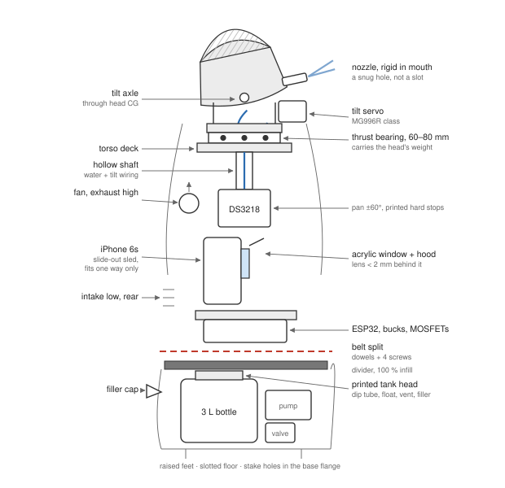
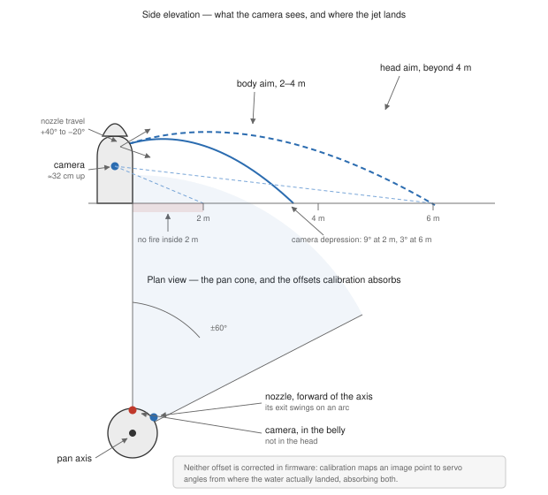
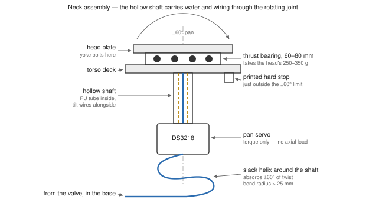
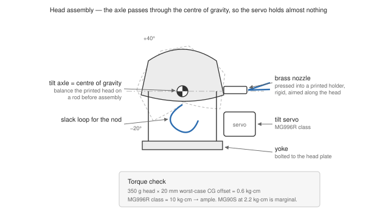
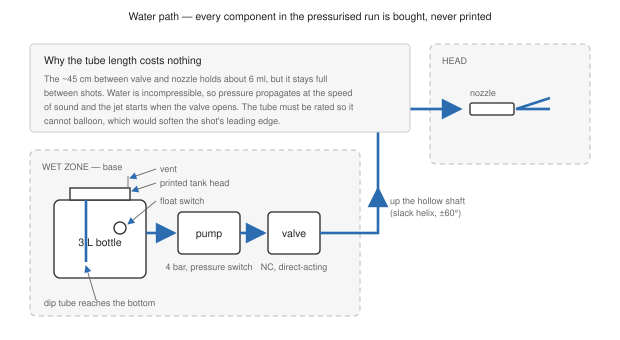
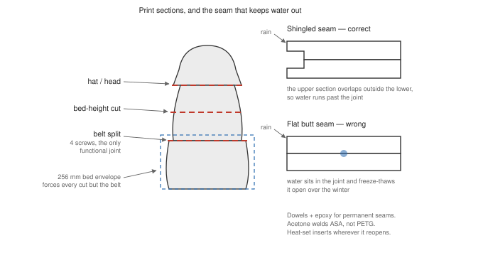

# Dwarf — Mechanical Design

- **Date:** 2026-09-21
- **Status:** Approved design, pre-CAD
- **Parent spec:** `2026-09-18-dwarf-cat-deterrent-design.md`
- **Sourcing:** `hardware/bom.md`

The printed body of the garden-gnome cat deterrent: how the head aims, how water reaches the
nozzle, how the thing is serviced, and how it survives a season outdoors.

*Figure 1 — Vertical section, gnome facing right. Everything above the belt split lifts off as
one piece.*

## 1. Decisions

| Question | Decision | Why |
|---|---|---|
| Pan drive | Servo in torso, short hollow shaft, **bought thrust bearing** carries the head | A servo shaft takes torque, not 350 g of axial load. Gear reduction was rejected: ±60° of head travel needs the servo's entire 180° at 1.5:1, and printed gear backlash returns most of the precision the reduction buys |
| Elevation | **The whole head nods** in a yoke; the nozzle is rigid in the mouth | A tilting nozzle inside a fixed head needs a vertical slot in the face, open to the sky, directly above the phone. A nodding head keeps that opening a snug hole. It also looks like the gnome is watching the cat |
| Service access | **Split at the belt**; the upper assembly lifts off as one piece | Head, turntable, phone and electronics come to the bench instead of being fished out of a 40 cm tube past the head mechanism |
| Refills | Screw-cap filler neck at the back of the base | Weekly-ish job; must not require opening the body |
| Valve location | Base, not head | A solenoid valve is 100–200 g and would double the head's mass |

## 2. Aiming geometry

The pan axis is vertical through the neck; the tilt axis is horizontal through the head's
centre of gravity. The nozzle sits forward of both, so its exit swings on an arc rather than
pivoting in place.

**No geometric correction is needed in firmware.** The Aimer is calibrated empirically —
image point in, servo angles out, fitted from where water actually landed — so every fixed
offset is absorbed: nozzle ahead of the pan axis, camera in the belly rather than the head,
head height above the ground. This is why the calibration in the parent spec records
`(x, y) → (pan, tilt, range_m)` from real test shots rather than from a model of the machine.

*Figure 2 — The camera sees 2–6 m from about 32 cm up, so the ground sits only 9° below
horizontal at 2 m and 3° at 6 m. Below: the pan cone, and the two offsets — nozzle ahead of
the pan axis, camera in the belly — that calibration absorbs rather than correcting.*

**Travel:** pan ±60°, tilt −20° to +40°. Printed hard stops sit a few degrees outside the
software limits, so a runaway command meets plastic instead of stripping a gearbox. The
firmware's `cfg` limits must stay inside the stops, never the reverse.

## 3. Head and neck

**Head.** Printed shell, estimated 250–350 g including the nozzle and the tube stub. It
pivots in a yoke on the turntable, on an axle passing through its centre of gravity. Balanced
that way the tilt servo holds almost nothing in steady state: the load is imbalance and wind,
not weight. At a 20 mm worst-case CG offset that is about 0.6 kg·cm, against roughly 10 kg·cm
from an MG996R-class servo — ample margin, and the reason the BOM upgrades away from the
2.2 kg·cm MG90S once the head itself has to move.

**Nozzle.** Rigid in the mouth, aimed along the head's axis, so the mouth is a close-fitting
hole. The wetted orifice is the bought brass nozzle pressed into a printed holder; the pivot,
if the holder needs adjustment, uses a metal pin, never printed-on-printed.

**Turntable.** A bought thrust bearing of 60–80 mm sits between the head plate and the torso
deck and carries the head's weight straight into the torso. The pan servo drives a short
hollow shaft through the bearing's centre and sees torque only. A printed ball race running on
6 mm **glass or stainless** balls is an acceptable fallback — never raw steel, which rusts in
a damp body — at the cost of friction and a little wobble.

**The hollow shaft is what makes the design work:** water and the tilt servo's wires pass
through it, so nothing has to seal against rotation. Two slack loops absorb the movement, a
helix around the shaft for pan and a loop inside the head for the nod. Keep the bend radius
above 25 mm; 8-bar PU tube tolerates this indefinitely at these cycle counts.

*Figure 3 — The neck. Water and tilt wiring pass through the middle of the rotating joint, so
nothing seals against rotation; a slack helix takes up the twist.*

*Figure 4 — The head, shown at both travel extremes. With the axle through the centre of
gravity the tilt servo carries imbalance and wind, not weight.*

**Dead volume is not a problem.** The ~45 cm of tube between valve and nozzle holds about
6 ml, but it stays full between shots and water is incompressible, so pressure propagates at
the speed of sound and the jet starts when the valve opens. The tube must be pressure-rated so
it does not balloon, which would soften the shot's leading edge.

*Figure 5 — Water path. Every component in the pressurised run is bought; the printed parts
hold things, they never contain pressure.*

## 4. Torso — the dry zone

**Phone sled.** The phone rides on a slide-out sled with a three-point locating feature and a
witness mark, and it must only fit one way. **Which way is still open, and it is a real
trade.** `DwarfCore` reads an animal's ground point as the bottom edge of its box, so the
frame handed to it must have gravity pointing down; the app corrects for the mount with
`Settings.quarterTurns`, verified on hardware by watching where the ground point lands on a
cat figurine. Landscape needs no correction at all and gives the wider horizontal view of the
garden, but wants about 145 mm of clear width inside the torso for a phone lying flat.
Portrait fits a narrower body and costs a rotation of every frame, which on an A9 is heat
that buys nothing. Decide it when the torso is printed, set one number, and recalibrate. This is the subtle requirement in the whole build:
the Aimer's calibration assumes the camera pose never changes, so a phone returned a few
millimetres rotated invalidates every stored calibration point. Repeatable reinstallation
makes a reboot a non-event; if the sled is ever disturbed, recalibration is the remedy.

**Camera window.** 3 mm acrylic, bonded from the inside with polyurethane sealant, with a
printed hood angled down about 10° above it. The clip-on wide lens sits under 2 mm behind the
acrylic to avoid reflections and vignetting. At ~32 cm mounting height the ground is 9° below
horizontal at 2 m and 3° at 6 m, so a slight downward pitch covers the working range inside
the lens's vertical field.

**Electronics deck.** ESP32, both buck converters, the MOSFET board and the fuse on M3
standoffs below the phone.

**Cooling.** A chimney: mesh intake low at the back, fan exhausting high under the hat brim,
both shaded. This serves the phone's 0–35 °C ambient rating, which is the tightest thermal
constraint in the project — tighter than any electronic part.

## 5. Base — the wet zone

**Tank.** A bought 3 L bottle in a printed cradle, closed by a **printed tank head that
screws onto the bottle's own thread**, carrying the dip tube, the float switch, a vent hole so
the pump cannot collapse the bottle, and the filler neck that runs to the cap at the back.
Nothing is ever cut into the bottle, so the component most likely to leak stays a
factory-sealed vessel. Printing the tank itself was rejected: FDM vessels weep at the Z-seam
over days, and the drip lands on the electronics.

**Pump** on soft grommets — it is the loudest part in the build, and hard-mounting turns the
shell into a speaker. **Valve** immediately after it, then a short run to the shaft.

**Divider.** Printed at 100 % infill with 4–6 perimeters, because a sparse panel is porous,
sealed to the shell with a polyurethane bead. Tube and wires cross it through glands with
drip loops.

**Floor.** Slotted, on raised feet, so a leak leaves rather than pools. The base flange has
stake holes: 3 kg of water is useful ballast, but a 55 cm gnome is also a sail.

## 6. Printing and fasteners

**Sections:** hat, head shell, upper torso, lower torso/base, plus the functional belt split.
The 256 mm bed forces most of these; the belt split is chosen, not forced.

**Joints:** dowel connectors and two-part epoxy for permanent seams — acetone welding works
on ASA but not on PETG. Heat-set inserts and M3 screws everywhere that reopens: the belt joint
(four screws), the decks, the hatches. Horizontal seams shingle, upper section overlapping
outside the lower, so rain runs past rather than sitting on a ledge and freeze-thawing through
winter.

**Materials:** light-coloured PETG throughout; ASA for the head and nozzle holder if an
enclosure is available, since those are small, low-warp and the most sun-exposed. Not PLA
anywhere — its glass transition is below the temperature a closed sunlit body reaches, and the
first thing to sag would be the servo mounts.

**Tolerances:** print a fit-test coupon before committing twenty hours to a torso section.
0.2–0.3 mm clearance for sliding fits is the starting point.

*Figure 6 — Where the body splits, and why horizontal seams shingle instead of butting.*

## 7. Assembly order

1. Print and dry-fit every section before gluing anything.
2. Install heat-set inserts while the parts are still separate and reachable.
3. Epoxy the permanent seams; leave the belt joint and all hatches mechanical.
4. Mount the bearing, pan servo and shaft to the torso deck; check the head turns freely
   through ±60° against the hard stops before any wiring.
5. Balance the head on its axle, then fit the yoke and tilt servo.
6. Route the tube and tilt wires through the shaft with both slack loops; cycle both axes by
   hand through their full travel and confirm nothing tugs or kinks.
7. Fit the window, hood, phone sled, electronics deck.
8. Assemble the base: tank head onto the bottle, cradle, pump, valve, float switch, glands.
9. Close the belt joint.

## 8. Service procedures

| Job | How | Frequency |
|---|---|---|
| Refill | Unscrew the filler cap at the back of the base | Every ~100 shots |
| Phone out | Four screws at the belt, lift the upper assembly, slide the sled | Rarely |
| Recalibrate | Required only if the sled or the head mechanism was disturbed | After such a service |
| Inspect tube loops | Look at both slack loops for kinking or chafing | At each refill |
| Recoat | Sand, adhesion promoter, opaque UV topcoat | Every couple of seasons |

## 9. Risks

| Risk | Mitigation |
|---|---|
| Phone pose shifts on reinstallation, silently invalidating calibration | Three-point sled that fits one way only; witness mark; recalibrate after any disturbance |
| Phone exceeds 35 °C ambient inside the body | Light colour, shaded chimney venting, ESP32-driven fan, shade placement; measured in M4 before a summer is trusted |
| Tube fatigue at the slack loops | Bend radius above 25 mm, pressure-rated PU, inspected at each refill |
| Gnome tips in wind | 3 kg water ballast low in the base, stake holes in the base flange |
| Nozzle orifice cannot be confirmed from a listing | Buy two or three candidates; they are a few francs each |
| Head imbalance overloads the tilt servo | Axle through the CG, verified by balancing the printed head on a rod before assembly |

## 10. Out of scope

- CAD modelling itself: this spec defines what the model must achieve, not its geometry.
- A rotary union for unlimited pan travel. Two slack loops cover ±60°, which is the design's
  aiming range.
- Winter operation. The system is spring-to-autumn, stored indoors over winter.
- Any printed part in the 4-bar water path.
