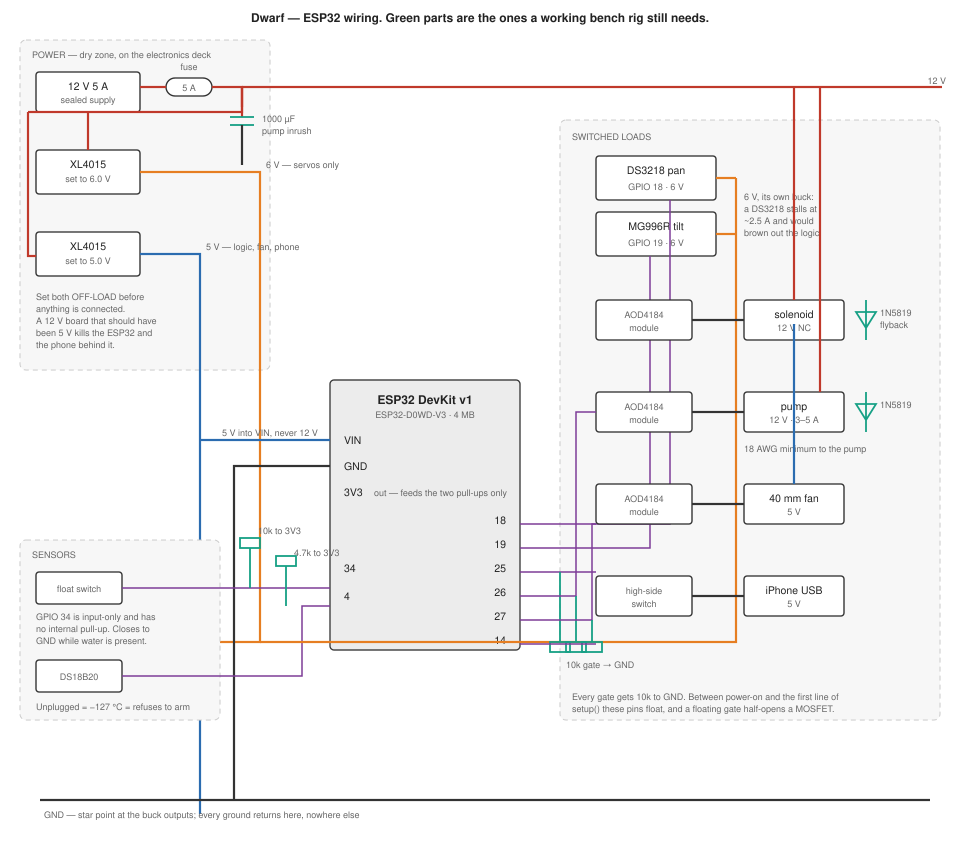

# Wiring

Everything that carries current in the gnome, and the small parts that keep it from
destroying itself. Pin numbers are the ones in `firmware/src/pins.h` — change them there,
not here, and this document follows.



*Figure 1 — Power on the left, the controller in the middle, switched loads on the right.
Everything drawn in green is a part the bench rig still needs and the bill of materials did
not originally list.*

## 1. Read this first

Four rules, each of which has a specific failure behind it.

1. **Set both buck converters before anything is connected to them.** Power each one from
   the 12 V supply on its own, turn the trimpot until the output reads 6.0 V and 5.0 V, then
   disconnect and wire the loads. An XL4015 arrives set to whatever the factory left it at,
   often the full input voltage. A 12 V board that should have been 5 V takes out the ESP32
   and the iPhone behind it in the same instant.
2. **One star ground.** Every ground returns to a single point at the buck outputs. Daisy
   chaining grounds through the pump's return puts its 5 A across the logic's reference, and
   the ESP32 browns out every time the pump kicks in.
3. **The 6 V rail is for servos and nothing else.** A DS3218 stalls at around 2.5 A. Sharing
   a rail with the logic means every hard servo move is a reset.
4. **Nothing is wired while the board is being flashed.** The gnome's first firmware runs
   `setup()` a few hundred milliseconds after power-on, and until it does, the outputs are
   not yet defined.

## 2. Power

| Rail | Source | Feeds |
|---|---|---|
| 12 V | Sealed 12 V 5 A supply, through a **5 A fuse** | Pump, solenoid valve, both buck converters |
| 6 V | XL4015 #1 | Pan and tilt servos only |
| 5 V | XL4015 #2 | ESP32 `VIN`, 40 mm fan, the iPhone's charging port |
| 3V3 | ESP32's own regulator | The two sensor pull-ups, nothing else |

**The ESP32 is powered from the 5 V rail into `VIN`, never from 12 V.** The devkit's
regulator accepts 5–12 V on paper, but at 12 V it dissipates the difference as heat inside a
sealed gnome that is already fighting for its thermal budget.

**Bulk capacitance.** A 1000 µF electrolytic across the 12 V rail, physically close to the
pump's MOSFET. A diaphragm pump's inrush is several times its running current, and without
it the rail sags far enough to reset the ESP32 at the exact moment it is trying to time a
300 ms burst.

## 3. Pin assignment

| GPIO | Direction | Connects to | The part that is easy to get wrong |
|---|---|---|---|
| 18 | out | Pan servo signal (DS3218) | 3.3 V logic into a 6 V servo. Works on these servos; if one jitters, a 74AHCT125 level shifter is the fix |
| 19 | out | Tilt servo signal (MG996R) | Same |
| 25 | out | Valve MOSFET gate | **10 kΩ gate to GND** |
| 26 | out | Pump MOSFET gate | **10 kΩ gate to GND**, and 18 AWG to the pump itself |
| 27 | out | Fan MOSFET gate | **10 kΩ gate to GND** |
| 14 | out | Charger high-side switch enable | **10 kΩ gate to GND**. Also a strapping-adjacent pin: it must not be held high at boot by anything external |
| 34 | **in only** | Float switch | **10 kΩ pull-up to 3V3.** GPIO 34 has no internal pull-up and cannot drive anything. The switch closes to GND while water is present |
| 4 | bidirectional | DS18B20 data | **4.7 kΩ pull-up to 3V3**, one for the whole bus |
| 33 | in | Pairing button, to GND | **10 kΩ pull-up to 3V3.** The internal pull-up measured insufficient on this board: the pin read LOW with nothing attached, which the firmware saw as a button held down |
| 2 | out | Onboard LED, blinks while pairing is open | Strapping pin, but driving it as an output after boot is ordinary |

Pins deliberately avoided: 0, 5, 12 and 15 are strapping pins and decide how the chip boots;
6–11 are wired to the flash chip. Nothing in this design touches any of them. GPIO 2 is also
a strapping pin and is the one exception: it is where the devkit's own LED already sits, it
is only ever driven as an output well after boot, and nothing external is attached to it.

## 4. The parts the bill of materials was missing

These came out of the firmware review, not the shopping list. All are cents, and all of them
prevent a specific, repeatable failure.

| Part | How many | Where | What happens without it |
|---|---|---|---|
| 10 kΩ resistor | 4 | Gate to GND on GPIO 25, 26, 27, 14 | Between power-on and `setup()`, the GPIOs float. A floating logic-level gate half-opens its MOSFET. **The valve opens every time the gnome reboots** |
| 10 kΩ resistor | 1 | GPIO 34 to 3V3 | The float switch reads as noise, and the tank looks empty or full at random |
| 10 kΩ resistor | 1 | GPIO 33 to 3V3 | The pairing button's pin floats low, which reads as a button held down. Firmware refuses to act on a press it never saw released, so the failure is a button that does nothing rather than a gnome that forgets its phone — but the resistor is what makes the button work at all |
| Momentary switch | 1 | GPIO 33 to GND, on the electronics deck | No button, no laptop-free recovery of a broken pairing. **Set `PAIR_BUTTON_FITTED` to true in `pins.h` once the switch and its pull-up are in place** — the firmware ignores the pin until then, because a floating input reads as a button held down and the button's whole job is to discard a working bond |
| 4.7 kΩ resistor | 1 | GPIO 4 to 3V3 | The 1-Wire bus never idles high; the DS18B20 is simply never found |
| 1N5819 or 1N4007 | 2 | Across the solenoid and across the pump, **cathode to +12 V** | Both are inductive. Switching them off without a path for the collapsing field puts hundreds of volts across the MOSFET, which fails **on** — a valve stuck open with no way to close it |
| 1000 µF ≥ 25 V electrolytic | 1 | Across the 12 V rail at the pump MOSFET | Pump inrush resets the ESP32 mid-burst |
| 5 A fuse and holder | 1 | In the 12 V supply's positive lead | A shorted pump has a 5 A supply behind it and 22 AWG wire in front of it |

The flyback diodes are the ones to be careful about. **Cathode — the banded end — goes to
+12 V**, the anode to the MOSFET's drain. Fitted backwards, the diode is a dead short across
the supply the moment power is applied.

## 5. Assembly order

1. Set both buck converters off-load. Confirm 6.0 V and 5.0 V with a meter.
2. Fuse, then the bulk capacitor, then the 12 V distribution. Watch the capacitor's
   polarity: the striped side is negative.
3. Star ground.
4. ESP32 from the 5 V rail into `VIN`. Power it up alone and confirm the serial console
   answers before anything else is attached.
5. The two sensor pull-ups, then the float switch and the DS18B20. The console should stop
   reporting `TEMP_SENSOR` the moment a working probe is on the bus.
6. Gate pull-downs on all four switched outputs, **before** the MOSFET modules.
7. MOSFET modules, then their flyback diodes, then the loads. Valve last.
8. Servos on the 6 V rail, signal wires to GPIO 18 and 19.

Step 6 before step 7 is not a stylistic preference. Wiring the loads first means the first
power-on after wiring is the one where the gates are floating and the valve is connected.

## 6. Checking it before water

With the tank empty and the pump's inlet in open air:

```
{"c":"hb"}                      status, and no fault
{"c":"arm","v":true}            "ok":true
{"c":"aim","pan":0,"tilt":0}    both servos move to centre
{"c":"aim","pan":-45,"tilt":20} both move, smoothly, no buzzing
{"c":"fan","v":true}            fan spins
{"c":"park"}                    returns to centre
{"c":"arm","v":false}           disarms
```

Then the one that matters: **power-cycle the board with everything connected and watch the
valve.** It must not so much as click. If it does, a gate pull-down is missing or on the
wrong pin.

Unplug the temperature probe while armed. The gnome must report `TEMP_SENSOR` and disarm
itself within a few seconds. That check exists because the firmware review found the
hardware layer quietly discarding the sensor's own failure signal, which would have left a
dead probe reading a plausible 22 °C forever.

Water comes after all of that, and it belongs to the bench checklist in the firmware plan's
Task 12 — outdoors or over a tub, on an RCD-protected outlet, with the 12 V supply and every
connection off the wet surface.
